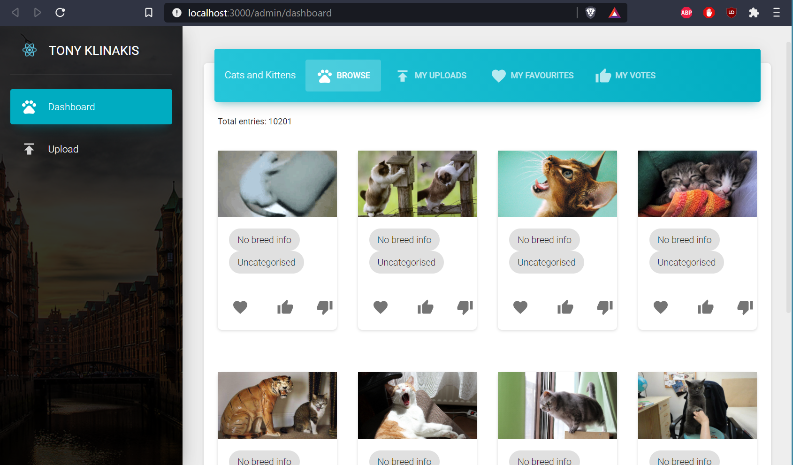
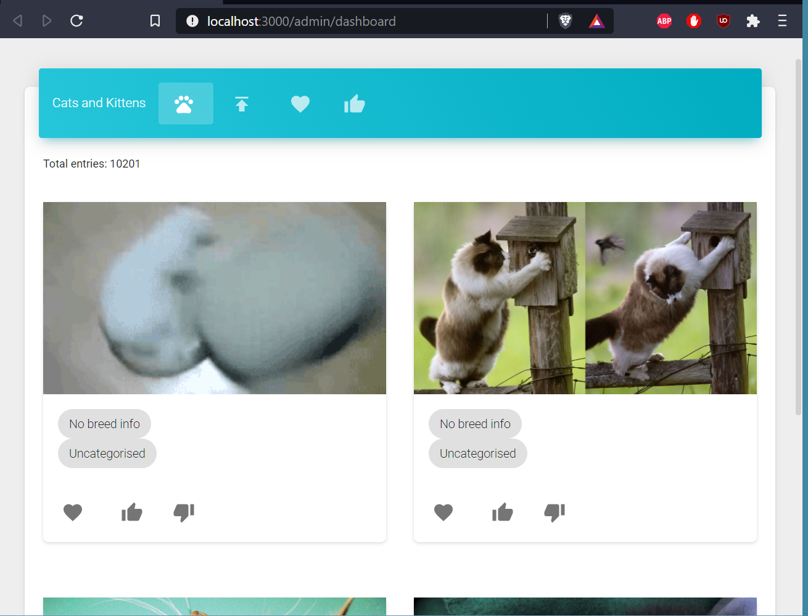

# Technical Test Submission

Desktop view

Responsive view

This is to be evaluated as a Proof of Concept.

The UI is Creative Tim's excellent [Dashboard UI][ctui]. When evaluating the
submission please focus on the following files:

## Building the Project

1. Check out this repo
1. Set an API key for `thecatapi.com` in [`/src/secrets.js`](/src/secrets.js)
1. Run `yarn`
1. Run `yarn run start`
1. Open `http://localhost:3000`

## Code Layout

_Logic_

- `src/hooks/store.tsx`
- `src/hooks/thecatapi.tsx`

_Components_

- `src/components/*Cat*` - ie. everything with _Cat_ in the name
- `src/components/*Votes*`

_Views_

- `src/views/UploadView` - Upload view. Corresponds to `/upload`
- `src/views/Dashboard` - Everything else. Corresponds to `/`

The code is split in two main views: The Dashboard, and the Upload page.

The **Dashboard** view uses a tabbed component to focus on four areas of
interest:

- _Browse_ - Get random cat pictures
- _My Uploads_ - See this user's uploaded pictures
- _My Favourites_ - This user's favourited pictures
- _My Votes_ - Pictures this user has voted on

The **Upload** view is a simple form, which uploads a picture to the relevant
endpoint.

## State Consolidation

The app is entirely state-driven using React's `useReducer`. There are no stray
API calls.

This is done by using _action_ functions that can be found in `thecatapi.tsx`,
beginning with `action`. They are a combination of API calls followed by calls
to `dispatch`.

Each item in the store corresponds to a cat image. These items contain any fields
returned by the API, plus any computed fields that are the result of consolidating
multiple API calls. For example, if an image has been voted on, it will contain
a field named `score`, which keeps the vote tally.

In the reducer function, the time always comes to merge the old and new state.
This is done by a deep merge, so that any information gained by previous actions
is not overridden - as would have been the case with a shallow merge.

## Components

The fundamental component is `CatItem`. This component accepts an `image_id` of
type `string`. It will display the associated picture and render the
action buttons for voting and setting/unsetting as _Favourite_.

Sometimes the image to be displayed is not present in the store. This happens if,
for example, a call to `/favourites` has been made, and we have the _favourite_
status of an ID, but we don't yet have the image itself. In this case `CatItem`
will dispatch a call to the appropriate endpoint, load the image into the store,
and then it will be re-rendered.

Next up is `CatGrid`, responsible for displaying `CatItem`s on a four-column
grid. Unlike `CatItem`, `CatGrid` is a dumb component and has no API logic of
its own. This grid component accepts an array of image IDs, of type `string`,
and maps each of them onto a `CatItem`.

Finally, there are four higher-level components: `FavouriteCats`, `SearchCats`, `MyCats` and
`Vote`. Each of these components will load attributes of interest from the relevant
endpoint, filter the store results based on those attributes, and pass on an array of
IDs onto `CatGrid`.

## Points of Improvement

### Pagination

I omitted pagination in the interest of time. The natural place for it would be
the `CatGrid` component.

## Known Issues

- The _Favourite_ button does not appear set when an item has been made favourite
- No error display when unsetting a _Favourite_ cat

[ctui]: https://www.creative-tim.com/product/material-dashboard-react
